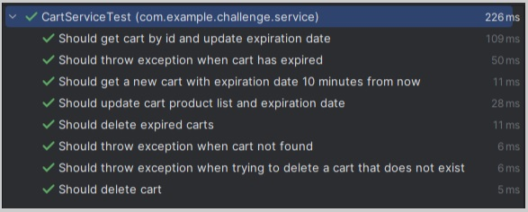
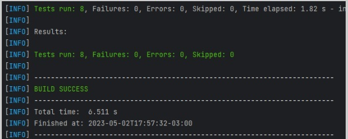
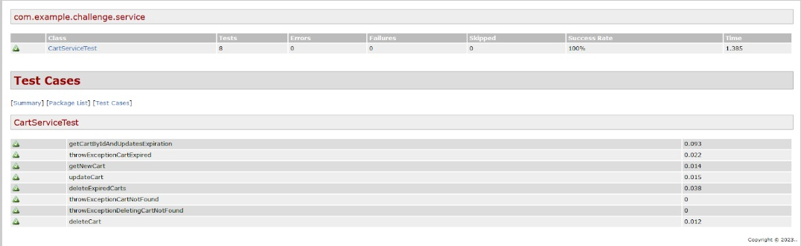
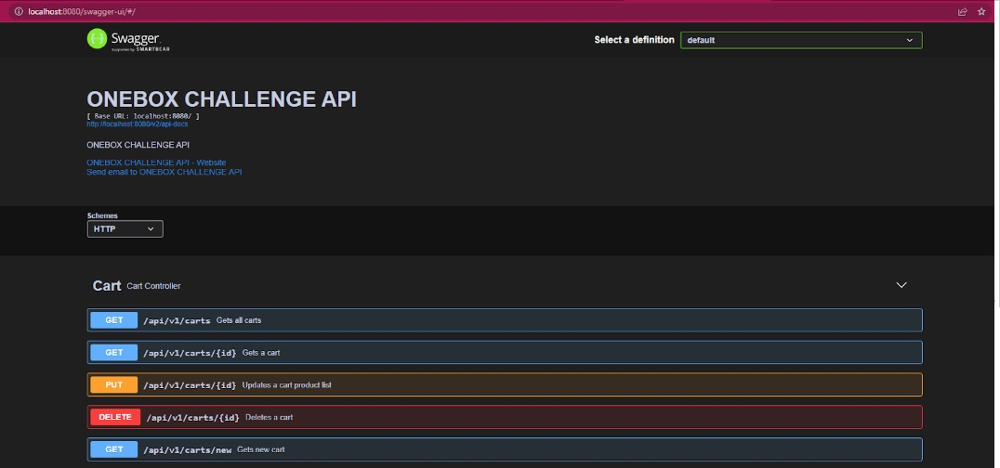

# Onebox Challenge - Miguel Coronel

## Setup:
- Development Language: Java 8 (Amazon Corretto)
- Main Framework: Spring Boot Framework
- Database: H2 Database (in-memory to facilitate challenge checking and testing) 
- Project Management: Maven
- Documentation: Swagger
- Testing: Junit Jupiter

## Workflow:
1. To start the workflow, the user should obtain a new empty cart with id and expiration information inside.
2. After the cart is created, the id could be use for the following requests:
    - GET cart information (including product list and expiration). *
    - UPDATE product list inside the cart. *
    - DELETE cart.
  *This operation will update expiration time (+10min).
3. Every minute, a worker runs to obtain a list of expired carts and then delete each one of them.


## Demonstration:

### GET new cart:

RQ:

**GET {{service-url}}/api/v1/carts/new**

RS:
```json
{
    "uuid": "8b557eba-409a-4990-b817-99f6e3fe711b",
    "expireAt": "2023-05-02T15:51:08.208",
    "productList": []
}
```

### GET cart information by ID:

RQ:

**GET {{service-url}}/api/v1/carts/8b557eba-409a-4990-b817-99f6e3fe711b**

RS:
```json
{
    "uuid": "8b557eba-409a-4990-b817-99f6e3fe711b",
    "expireAt": "2023-05-02T15:52:58.385",
    "productList": []
}
```

### UPDATE cart product list:

RQ:

**PUT {{service-url}}/api/v1/carts/8b557eba-409a-4990-b817-99f6e3fe711b**
```json
[
    {
        "id": 1,
        "description":"A new product description",
        "amount":12.00
    },
    {
        "id": 2,
        "description":"Another product description",
        "amount": 23.00
    },
    {
        "id": 3,
        "description": "One more product description",
        "amount": 4.00
    }
]
```

RS:
```json
{
    "uuid": "297f4e27-f4e4-48f8-8822-6e341c200f14",
    "expireAt": "2023-05-02T13:46:47.946",
    "productList": [
        {
            "id": 2,
            "description": "product description 2",
            "amount": 2.00
        },
        {
            "id": 3,
            "description": "product description 3",
            "amount": 3.00
        },
        {
            "id": 4,
            "description": "product description 4",
            "amount": 4.00
        }
    ]
}
```

### DELETE cart:

RQ:

**DELETE {{service-url}}/api/v1/carts/8b557eba-409a-4990-b817-99f6e3fe711b**

RS:

**CODE 200 - OK**


### GET all carts (for demo purposes)

RQ:

**GET {{service-url}}/api/v1/carts**

RS:
```json
[
    {
        "uuid": "c5ffc86c-7d67-4656-bbd1-81d22e8da67b",
        "expireAt": "2023-05-02T17:06:35.958",
        "productList": []
    },
    {
        "uuid": "e7f1bd98-50ea-4390-9192-74b7fa144876",
        "expireAt": "2023-05-02T17:06:38.234",
        "productList": []
    },
    {
        "uuid": "f8b5ff7d-c85c-4193-9fa4-5ca25e63a1c0",
        "expireAt": "2023-05-02T17:06:49.075",
        "productList": [
            {
                "id": 1,
                "description": "A new product description",
                "amount": 12.00
            },
            {
                "id": 2,
                "description": "Another product description",
                "amount": 23.00
            },
            {
                "id": 3,
                "description": "One more product description",
                "amount": 4.00
            }
        ]
    },
    {
        "uuid": "1b3496f2-7df8-4b7b-8c10-ec5ce24d3bcb",
        "expireAt": "2023-05-02T17:07:27.747",
        "productList": [
            {
                "id": 4,
                "description": "A new product description",
                "amount": 12.00
            },
            {
                "id": 5,
                "description": "Another product description",
                "amount": 23.00
            },
            {
                "id": 6,
                "description": "One more product description",
                "amount": 4.00
            }
        ]
    }
]
```

- INFO: A postman collection would be attached along with this document to support api check/testing.

### Error / Exception Handling:

- Cart Not Found:

```json
{
    "timestamp": "2023-05-03T19:39:08.312",
    "code": "NOT_FOUND",
    "message": "Illegal State Exception: Could not find a cart with this id: 86e0f5de-95b2-4088-baaf-4a7ade5ddffe",
    "details": "uri=/api/v1/carts/86e0f5de-95b2-4088-baaf-4a7ade5ddffe",
    "errors": [
        "Could not find a cart with this id: 86e0f5de-95b2-4088-baaf-4a7ade5ddffe"
    ],
    "subcode": 3000
}
```
- Invalid data / Param missing:

```json
{
  "timestamp": "2023-05-03T20:07:43.003",
  "code": "INVALID_DATA",
  "message": "Exception method argument not valid with cause = 'null' and exception = 'org.springframework.web.bind.MethodArgumentNotValidException: Validation failed for argument [1] in public org.springframework.http.ResponseEntity<?> com.example.challenge.controller.CartController.updateCart(java.lang.String,com.example.challenge.DTO.ProductListUpdateDTO) with 3 errors: [Field error in object 'productListUpdateDTO' on field 'productList[0].description': rejected value [null]; codes [NotBlank.productListUpdateDTO.productList[0].description,NotBlank.productListUpdateDTO.productList.description,NotBlank.productList[0].description,NotBlank.productList.description,NotBlank.description,NotBlank.java.lang.String,NotBlank]; arguments [org.springframework.context.support.DefaultMessageSourceResolvable: codes [productListUpdateDTO.productList[0].description,productList[0].description]; arguments []; default message [productList[0].description]]; default message [Product description cannot be null/empty/blank]] [Field error in object 'productListUpdateDTO' on field 'productList[0].amount': rejected value [null]; codes [NotNull.productListUpdateDTO.productList[0].amount,NotNull.productListUpdateDTO.productList.amount,NotNull.productList[0].amount,NotNull.productList.amount,NotNull.amount,NotNull.java.math.BigDecimal,NotNull]; arguments [org.springframework.context.support.DefaultMessageSourceResolvable: codes [productListUpdateDTO.productList[0].amount,productList[0].amount]; arguments []; default message [productList[0].amount]]; default message [Product amount cannot be null]] [Field error in object 'productListUpdateDTO' on field 'productList[0].id': rejected value [null]; codes [NotNull.productListUpdateDTO.productList[0].id,NotNull.productListUpdateDTO.productList.id,NotNull.productList[0].id,NotNull.productList.id,NotNull.id,NotNull.java.lang.Long,NotNull]; arguments [org.springframework.context.support.DefaultMessageSourceResolvable: codes [productListUpdateDTO.productList[0].id,productList[0].id]; arguments []; default message [productList[0].id]]; default message [Product id cannot be null]] '",
  "details": "uri=/api/v1/carts/2c58006a-ab87-42ea-bd6c-ef16925a43c3",
  "errors": [
    "productList[0].description: Product description cannot be null/empty/blank",
    "productList[0].amount: Product amount cannot be null",
    "productList[0].id: Product id cannot be null"
  ],
  "subcode": 1000
}
```


## Unit Testing:
- RUNNING mvn test






- RUNNING mvn surefire-report:report



## API Documentation:
URL: {{service-url}}//swagger-ui/


